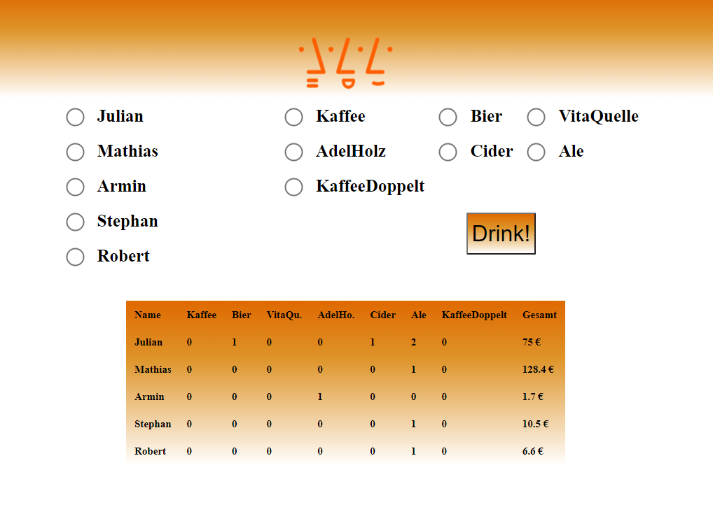

# Digital Coffee List - COffice

This project was developed to get rid of the paper based analog version of tracking the coffee and other beverages. (Naming: Coffee + Office = COffice)

The names and values in the table are examples ;)

## Usage
Click the name and the Item. Finally click on Buy and you are good to go.

## Installation

- Install xampp on you system which should work on Ubuntu and Windows.

- The repository is running using XAMPP. Install the XAMPP Server and place the repo inside the following folder:
C:\xampp\htdocs\

Your structure you look like this:

/opt/lampp/htdocs/coffice
├── addToConsumptionHistory.php
├── db_connection.php
├── docs
│   └── FrontEnd.PNG
├── getConsumablesList.php
├── getConsumptionTable.php
├── getUserList.php
├── images
│   └── hsa_logo.png
├── index.html
├── readme.md
└── style.css

- Setup a mysql database using the template given in the folder databaseTemplate. Make sure to setup the credentials for the database according to "db_connection.php"

- After XAMPP is started you can browse "http://localhost/coffice" on your local machine. 

- Users and consumables can be added deleted or modified using phpMyAdmin: http://localhost/phpmyadmin/index.php

## Trouble shooting 
No trouble at all ;)

